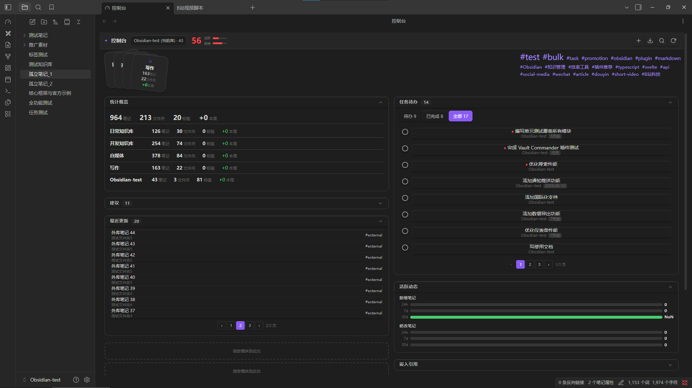
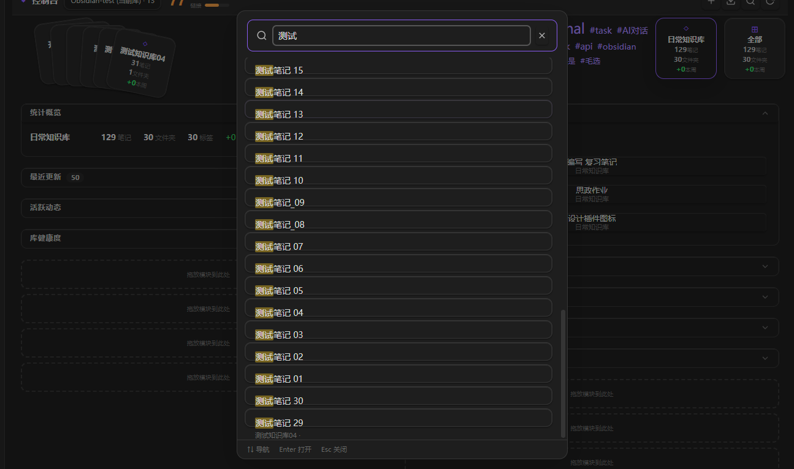
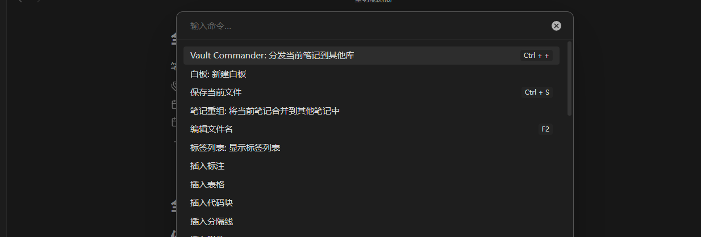
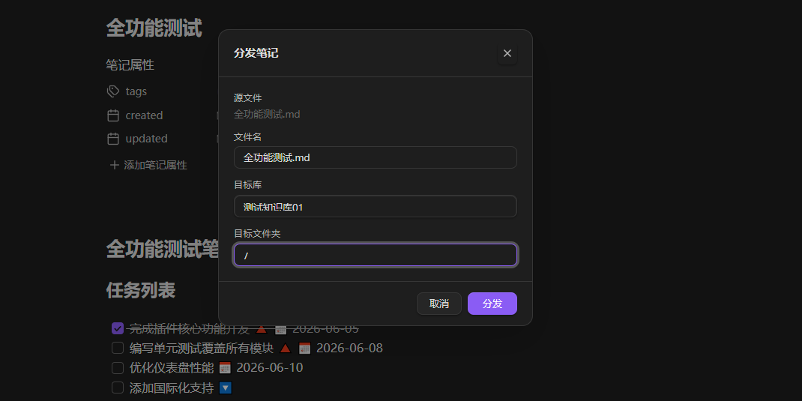

# Vault Commander（控制台）

Obsidian 跨库管理插件 — 仪表盘、搜索、笔记分发、洞察。在同一界面管理多个 Obsidian 知识库，支持仪表盘、跨库搜索、笔记分发导入、任务追踪、健康度分析。

---

## 使用者

### 安装

从 [Releases](https://github.com/Aze333Sun/obsidian-vault-commander/releases) 下载 `main.js`、`manifest.json`、`styles.css`，放入 `<vault>/.obsidian/plugins/vault-commander/`，重启 Obsidian，在设置中启用。

### 快速开始

| 操作 | 方式 |
|------|------|
| 打开控制台 | 左边栏 ◇ 图标 / `Ctrl+P` → 打开控制台 |
| 刷新扫描 | 标题栏 ↻ 按钮 |
| 跨库搜索 | 标题栏 🔍 按钮 / `Ctrl+Shift+F` |
| 新建分发 | 标题栏 + 按钮 |
| 导入笔记 | 标题栏 ↓ 按钮 |

### 功能

| 模块 | 说明 |
|------|------|
| 仪表盘 | 拖拽布局、堆叠卡片、多库统计概览 |
| 任务待办 | 自动识别 `#task`/`#todo` 标签笔记中的 `- [ ]` 列表 |
| 跨库搜索 | MiniSearch 全文检索，高亮匹配 |
| 笔记分发 | 将当前笔记一键发送到其他库 |
| 笔记导入 | 从外库浏览并导入笔记到当前库 |
| 健康度 | 活跃度、链接完整性评分 |
| 标签云 | 前 20 高频标签，跟随库切换 |
| 调试面板 | 事件日志、扫描状态、错误追踪 |

### 添加外库

设置 → 控制台 → 添加分库，填写名称和路径（如 `E:/Obsidian`），点击刷新即可。

### 任务管理

在笔记 frontmatter 添加 `tags: [task]` 或 `tags: [todo]`，内容中的任务列表自动识别：

```markdown
---
tags:
  - task
---

- [ ] 完成需求文档 🔺 📅 2026-06-10
- [x] 已完成的旧任务
```

- `🔺⏫` = 高优先级，`🔼` = 中，`🔽` = 低
- `📅 2026-06-10` = 截止日期
- 点击复选框直接切换完成状态

### 仪表盘操作

- 模块可拖拽重新排列，左右两栏各 8 格
- 点击堆叠卡片选中外库 → 内容筛选；再次点击或点「全部」→ 汇总视图

---

## 开发者

### 构建

```bash
git clone https://github.com/Aze333Sun/obsidian-vault-commander.git
cd obsidian-vault-commander
npm install
npm run build   # 产物: main.js, styles.css, manifest.json
```

### 部署到本地测试

```bash
npm run build
cp main.js manifest.json styles.css "<vault>/.obsidian/plugins/vault-commander/"
```

### 脚本

```bash
npm run dev           # 监听构建
npm run build         # 类型检查 + 生产构建
npm run typecheck     # 仅类型检查
npm run test          # 76 个单元测试
npm run test:coverage # 本地覆盖率
npm run format        # 格式化代码
```

### CI/CD

Push 自动触发：类型检查 → 76 测试 → 格式校验 → 构建检查 → `main` 分支自动 Draft Release。

### 技术栈

TypeScript + Svelte 4 + esbuild + MiniSearch + idb-keyval + Vitest

### 项目结构

```
src/
├── main.ts          — 插件入口
├── settings.ts      — 设置页 UI
├── types/           — 类型定义
├── core/            — 扫描器、缓存、搜索引擎、分发器、分析器、事件总线
├── ui/              — Dashboard + 组件
├── views/           — Obsidian ItemView
├── modals/          — 搜索/新建/分发/导入/预览
└── utils/           — 工具函数
test/                — 11 个测试文件，76 个用例
```

---

## 使用截图

### 仪表盘



### 跨库搜索



### 笔记分发





---

## 许可证

MIT © ze

## 强调

本项目基于 Claude Code 进行开发，如介意请勿使用。项目 `.claude` 文件共享，方便克隆者进行二开。
